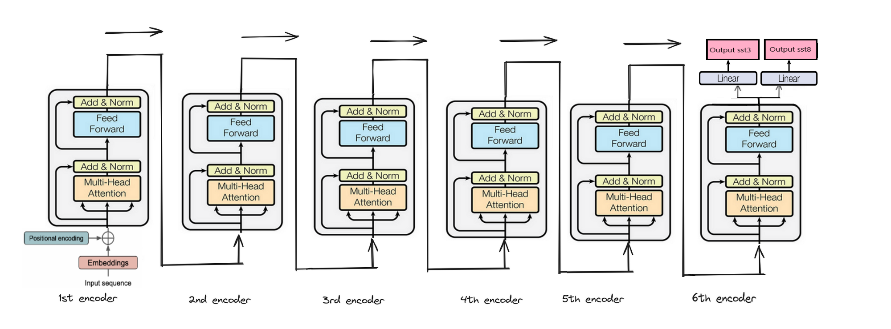

# 🧬 Deep Learning for Protein Structure Prediction

## 📌 Project Overview
This project explores the application of **deep learning** in **Protein Secondary Structure Prediction (PSSP)**. We developed a state-of-the-art machine learning model, utilising **Transformers, CNNs, and RNNs**, to predict secondary structures (SST3 & SST8) of proteins from their amino acid sequences.

By integrating **sequence-to-sequence modeling**, **long-range dependencies**, and **local pattern recognition**, our model achieves **high prediction accuracy** while maintaining computational efficiency.

## 🗂️ Dataset
We use a **protein sequence dataset** containing:
- **[seq]** - Amino acid sequence of peptides
- **[sst3]** - Three-state secondary structure classification (helix, strand, coil)
- **[sst8]** - Eight-state secondary structure classification

🔹 Input: **Protein sequence (`seq`)**  
🔹 Output: **SST3 and SST8 structures**

---

### 🛠️ **Data Preprocessing**

#### **1️⃣ Tokenization (N-gram Encoding)**
- We use **3-gram tokenization**, breaking each protein sequence into overlapping **n-grams** (n=3).
- **Why n=3?** Research suggests a sliding window of 3 captures structural and biochemical patterns effectively.
- Each unique **3-gram** is mapped to an integer using TensorFlow’s `Tokenizer()`.

#### **2️⃣ Padding Sequences**
- Since sequences vary in length, we **pad** them to a fixed length of **192** to ensure uniform input dimensions.
- Padding is applied **post-sequence** to preserve original ordering.

#### **3️⃣ Encoding Target Labels (SST3 & SST8)**
- The target labels (SST3 & SST8) are **tokenized at the character level** instead of n-grams.
- Each secondary structure state (e.g., `H`, `E`, `C` for SST3) is mapped to a unique integer.
- This ensures correct sequence-to-sequence learning for both SST3 and SST8 classifications.

🔹 **Illustration of 3-gram Tokenization**  


---

Let me know if you need any modifications! 🚀

## 🏗️ Proposed Model Architecture
We implemented and tested **two architectures**:

### 1️⃣ **Base Model** (Transformer-only)
🔹 **Architecture of Base Transformer Model** 

- **Embedding Layer**: Converts amino acids into vector representations.
- **Positional Encoding**: Provides sequence order information.
- **6 Transformer Encoders**:
  - Multi-head self-attention
  - Layer normalization & residual connections
  - Feed-forward network 
  - Dropout regularization 
- **Separate classifiers** for **sst3** and **sst8**.

### 2️⃣ **Improved Model** (CNN-RNN-Transformer) 
🔹 **Architecture of CNN-RNN-Transformer Model**  

To enhance performance, we integrated additional layers into our base **Transformer** architecture:  
- **1D CNN**: Captures local sequence patterns.  
- **Bidirectional LSTM**: Preserves sequential dependencies.  

These additions help the Transformer model better capture both **short-range interactions** (CNN) and **long-range dependencies** (LSTM), ultimately improving accuracy in **Protein Secondary Structure Prediction (PSSP).** 🚀

---

## ⚙️ Training & Hyperparameter Tuning
🔹 **Training and validation loss across different hyperparameters** 


📊 **Best Model Configuration**
| **Embedding Dim** | **Attention Heads** | **FFN Size** | **Encoder Layers** | **sst3 Accuracy** | **sst8 Accuracy** |
|------------------|-------------------|-------------|----------------|----------------|----------------|
| 512              | 16                 | 2048        | 6              | 0.9224         | 0.8693         |

---

## 📊 Results & Evaluation
🔬 **Comparison of Base & Improved Model**:
| **Model**             | **sst3 Accuracy** | **sst8 Accuracy** |
|----------------------|----------------|----------------|
| **Base (Transformer-only)** | 0.9224 | 0.8693 |
| **Improved (CNN-RNN-Transformer)** | 0.9334 | 0.8842 |

- **Improved model** had a **small accuracy gain**, indicating **diminishing returns** due to the high baseline performance of Transformers.


- **Transformers** performed **better on longer sequences**.
- **sst3 predictions** were **more accurate** than sst8 due to fewer class labels.

📈 **Key Observations**:
- **Longer sequences improve accuracy** (Transformers perform better on long inputs).
- **Sequence diversity affects generalization** (LSTM captures sequence flow).
- **Local pattern recognition is crucial** (CNN improves short-range dependencies).

---

## 🏃‍♂️ How to Run
### 🛠 Prerequisites
- `Python 3.8+`
- `TensorFlow 2.x`
- `NumPy`
- `Matplotlib`
- `Scikit-learn`
- `Jupyter Notebook`

### 🚀 Running the Model
```bash
# Clone the repo
git clone https://github.com/your-username/protein-structure-prediction.git
cd protein-structure-prediction

# Install dependencies
pip install -r requirements.txt

# Train the model
python protein_train.py
```

---

## 📚 References
📄 Research Papers:
- **AlphaFold (Jumper et al., 2021)**: [Nature](https://www.nature.com/articles/s41586-021-03819-2)
- **Protein Secondary Structure Prediction (Baldi et al., 2002)**: [PDF](http://citeseerx.ist.psu.edu/viewdoc/download?doi=10.1.1.104.7092)
- **Transformer Scaling Laws (Tay et al., 2022)**: [arXiv](https://arxiv.org/abs/2109.10686)
- **Sequence Representation Learning (Asgari & Mofrad, 2015)**: [PLoS ONE](https://doi.org/10.1371/journal.pone.0141287)
---
